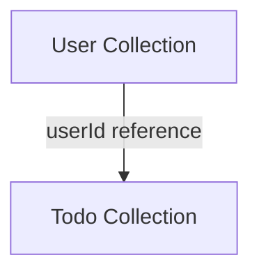
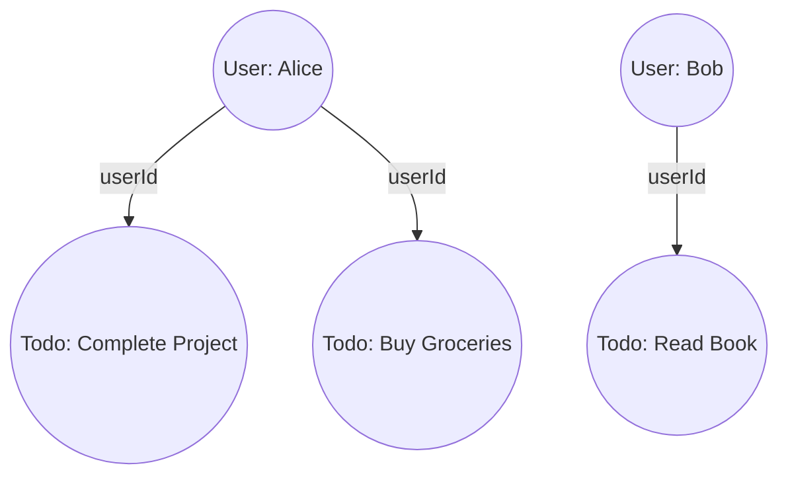

---
tags:
  - mongo
---
---
# 🧠 MongoDB Relationships — Full Explanation

MongoDB is a **NoSQL** database — it's **document-based**, so unlike SQL, it does **not** enforce strict relationships like foreign keys.

However, **relationships** still exist and are very common!

There are **two main types** of relationships in MongoDB:

|Type|Meaning|
|---|---|
|**Embedding**|Store related data **inside** the same document.|
|**Referencing**|Store a **reference** (id) to another document stored elsewhere.|

In your TODO example, you are using **Referencing**.

---

# 📚 Why Use Relationships in MongoDB?

|Reason|Description|
|---|---|
|**Normalize Data**|Avoid repeating same data (example: user info inside every todo).|
|**Maintain Data Integrity**|If user info changes, we don't have to update every document manually.|
|**Efficient Queries**|Quickly fetch and populate related data using `.populate()` method.|
|**Cleaner Schemas**|Organizes data better across collections (easier to scale).|

---

# 🛠️ How To Set Up Relationships — Step-by-Step

## 1. Define Collections with Reference

Suppose you have:

- **User** collection
    
- **Todo** collection
    

✅ **User Schema**

```javascript
const mongoose = require('mongoose');
const { Schema } = mongoose;

const UserSchema = new Schema({
    name: String,
    email: String
});

const UserModel = mongoose.model('users', UserSchema);
```

✅ **Todo Schema (with reference to User)**

```javascript
const TodoSchema = new Schema({
    userId: { type: Schema.Types.ObjectId, ref: 'users' },
    title: String,
    done: Boolean
});

const TodoModel = mongoose.model('todos', TodoSchema);
```

---

## 2. Create and Save Data

✅ **Create a User**

```javascript
const user = new UserModel({
    name: "Alice",
    email: "alice@example.com"
});
await user.save();
```

✅ **Create a Todo linked to User**

```javascript
const todo = new TodoModel({
    userId: user._id,  // Reference user ID
    title: "Complete MongoDB Project",
    done: false
});
await todo.save();
```

---

## 3. Query with `.populate()`

✅ **Fetching Todos with User Info**

```javascript
app.get("/todos", async (req, res) => {
    const todos = await TodoModel.find()
        .populate('userId')   // Populate the user document
        .exec();

    res.json({ todos });
});
```

**Result Example:**

```json
{
  "todos": [
    {
      "_id": "abc123",
      "title": "Complete MongoDB Project",
      "done": false,
      "userId": {
          "_id": "xyz789",
          "name": "Alice",
          "email": "alice@example.com"
      }
    }
  ]
}
```

---

# 🧩 Flowchart of MongoDB Relationships

Let's use a simple **Flowchart** to understand the data flow:



Meaning:

- **User** creates an account.
    
- **Todo** is linked using **userId** (ObjectId reference).
    

---

# 🎨 Detailed Mermaid Diagram with Populate



---

# ✨ Key Features of MongoDB References

|Feature|Description|
|---|---|
|**.populate()**|Joins referenced documents when querying.|
|**Flexible Schemas**|You can reference any collection dynamically.|
|**Partial Population**|Populate only selected fields.|
|**Multiple References**|One document can reference multiple collections.|

---

# 🧪 Bonus: Populate Specific Fields Only

✅ Suppose you only want the user's name, not the email:

```javascript
TodoModel.find()
    .populate('userId', 'name')  // Only get name field from User
    .exec();
```

Result will be lighter:

```json
"userId": {
  "_id": "xyz789",
  "name": "Alice"
}
```

---

# ✅ Best Practices for MongoDB Relationships

|Practice|Reason|
|---|---|
|Use **Embedding** for small, tightly coupled data.|Example: address inside a user.|
|Use **Referencing** for large, loosely coupled data.|Example: todos linked to users.|
|Always **index reference fields** (like userId)|Speeds up queries.|
|**Avoid deep populates** unless necessary.|Each populate increases database load.|

---

# 📜 Summary

> In MongoDB, **relationships** are typically implemented using **References**.  
> We reference another collection using the **ObjectId** and can retrieve complete information using the `.populate()` method, achieving **normalized** and **efficient** data management.

---
